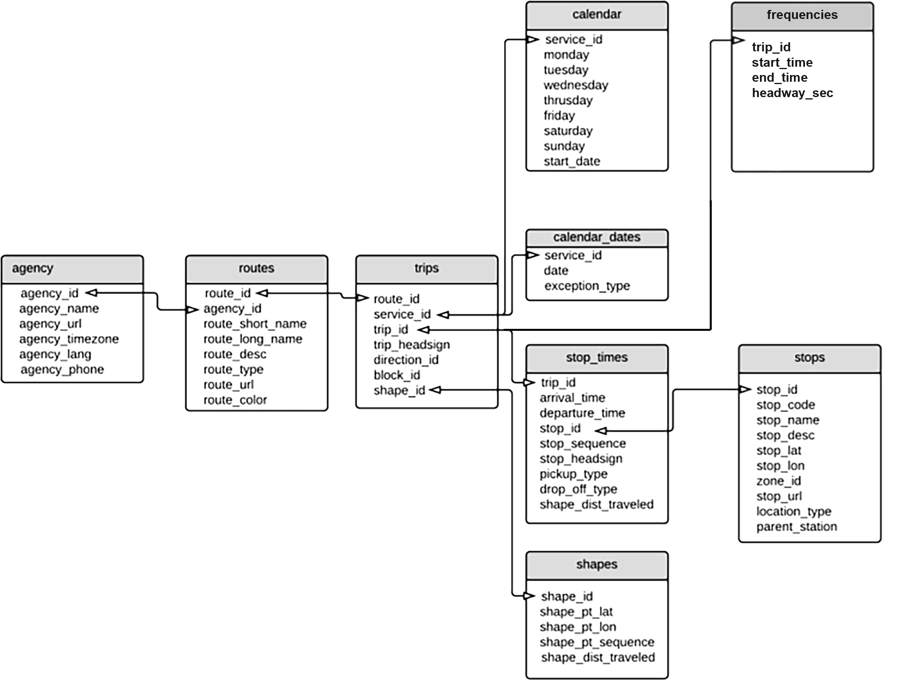

# GTFS4EV
**GTFS4EV (GTFS for Electric Vehicles) is a python code aiming to simulate the daily electric energy demand of a transport system powered by electric vehicles using GTFS data.** 

GTFS data is used to model the mobility behaviour of a vehicle along each trip according to the stop_times.txt file. Then, the frequencies.txt file is used to estimate the number and distribution of vehicles on each trip. Estimated electrical power dissipation and energy consumption are based on a user-specified energy demand per kilometer (kWh/km). 

More generally, the code provides the following features:

- GTFS data check-up and filtering
- Extraction of transport system characteristics from GTFS data: area covered by the system, route length, distance between stops, etc.
- Assessment of topological characteristics 
- Simulation of the transport system operation and assessment of operational outputs: number of vehicles on the road, speed, distance covered by each, etc.
- Power and energy profile along the day, for each route or the entire vehicle fleet

> :memo: **Note:** GTFS stands for General Transit Feed Specification. It is a standardized data format designed for scheduled transport systems, in the form of a set of .txt files describing various aspects of the system and linked together using a relational data structure. Importantly, it contains both spatial and temporal data, paving the way for mobility simulation. The main useful files and their links are shown in the following figure. Note that for the code to work, some GTFS files that are officially optionnal are required, such as shapes.txt and frequencies.txt. For more detailed information about GTFS data, please visit the [google documentation](https://developers.google.com/transit/gtfs).

<center>
	 
	<p><font size="-1">GTFS data structure showing the relations between the different tables. Adapted from: J. Vieira, Transp. Res. Part D, 2023.</font></p>
</center>

authors = Jeremy Dumoulin, Alejandro Pena-Bello, Noémie Jeannin, Nicolas Wyrsch  
contact = jeremy.dumoulin@epfl.ch  
langage = python 3  
repository = https://gitlab.epfl.ch/PVLAB/SYSTEM/openmod4africa/gtfs4ev 


## Installation

1. Get the latest version of the code on GitLab on your local machine. If you are not familiar with git, you can also manually download the folder from GitLab and then run the code. However, you won't be able to have access to contribute to the project.
```bash
$ git clone https://gitlab.inl90.ec-lyon.fr/jdumoulin/sqbalance.git
```

2. Create a conda environment with the required dependencies. 
```bash
$ conda env create -f environment.yml
$ conda activate gtfs4ev
```
> :thumbsdown: If you do not want to use a virtual environment, you can also manually install the python dependencies (not recommended). Code was developed and tested using python 3.12, and the list of required modules is available in the `environment.yml` file.

3. Run the tests to make sure everything is working properly.
```bash
To-be-implemented
```

## Usage

### Input and output data
The **input data** should be placed in the dedicated `/input` folder. The input files are of two types:   

- GTFS data sets  
- GIS data (such as OSM roads)

> :warning: <span style="color:#dd8828">**Important:** If your GTFS data is in the form of a .zip file, you'll need to extract it manually into the '/input' folder.</span>

After running the simulation, some **output data** will be automatically stored in the dedicated `/output` folder. We also recommend using this folder to store any other simulation results.

> :memo: **Note:** If you would like to use other folders to store input and output data, you can set your own path by changing the values of the OUTPUT_PATH and INPUT_PATH variables defined in the `gtfs4ev/environment.yml` file. You can do it either by changing directly the values in the file or at the beginning of the python script used to run the simulation (see next section).
```python
from gtfs4ev import environment as env

env.OUTPUT_PATH = "my_output_path"
env.INPUT_PATH = "my_input_path"
``` 

### Running simulations

To run the code, you need to import the various modules you want to use from the `gtfs4ev/` package into a new python script. For the time being, you will find two types of modules in the package:

* The core **classes** of gtfs4ev: GTFSFeed, TripSim, TrafficSim
* Some more generic **helpers**: environment.py, helpers.py, constants.py, topology.py 

Both can be imported as modules to be used in the python script.
```python
# Core classes
from gtfs4ev.gtfsfeed import GTFSFeed
from gtfs4ev.tripsim import TripSim
from gtfs4ev.trafficsim import TrafficSim

# Helpers
from gtfs4ev import constants as cst
from gtfs4ev import environment as env
from gtfs4ev import helpers as hlp
```

The helper modules speak for themselves. The following is a brief description of the core classes, but the user is referred to the classes themselves for a more detailed description:

* **GTFSFeed**: Holds the GTFS feed. Is instantiated using a GTFS data folder in the input folder. Provides features for checking GTFS data, filtering data (e.g. to keep only services present on certain days), and extracting general information about the feed. This class is purely about analyzing and curating data; no modeling involved here.  
* **TripSim**: Simulates the behaviour of a single vehicle or a vehicle fleet along a trip and extracts relevant metrics. Is instantiated using a GTFSFeed, the trip_id, and the electric vehicle consumption (kWh/km). Provides both operational metrics and power/energy profiles.
* **TrafficSim**: Simulates the behaviour of a vehicle fleet along a set of several trips. Is instanciated using a GTFSFeed, a list of trip_ids, and a list of corresponding electric vehicle consimption (kWh/km). Provides operational metrics and profiles for the set of trips. 

> :bulb: **Tip:** For a quick start, we recommend running the main.py file, which comes with different sections of code that you can simply uncomment to get to familiar with the code step by step.

## Contributing

All contributions are welcome. For major changes, please create a new branch first.
Please also make sure to update tests as appropriate.

### Open tasks

- [ ] Map GTFS shapes with OSM data
- [ ] Upgrade data filtering
- [ ] Potential benefits of electrification
- [ ] Spatio-temporal visualisation of the fleet evolution
- [ ] Improve closest point mapping (interpolate between points)

### Backlog

- [ ] Let the user set the desired projection CRS
- [ ] Assess some accessibility metrics by crossing the data with other GIS data 
- [ ] Write some unit tests 
- [ ] Improve GTFS data analysis, cleaning, and filtering ; perhaps by relying on an external library

### Done

- [x] Update the README and create a virtual environment
- [x] Create a topology class
- [x] Get the code ready for collaboration: upload to GitLab and better comment classes

## License

[MIT](https://choosealicense.com/licenses/mit/)

## Good to know

- [Introduction to GTFS #1](https://www.youtube.com/watch?v=8OQKHhu1VgQ)
- [Introduction to GTFS #2](https://www.youtube.com/watch?v=SDz2460AjNo)
- [Official GTFS documentation](https://gtfs.org/)
- [Google GTFS documentation]()